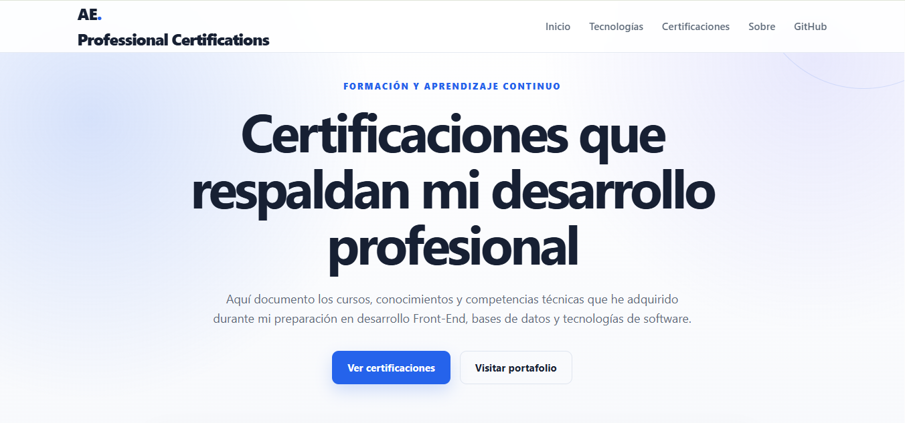
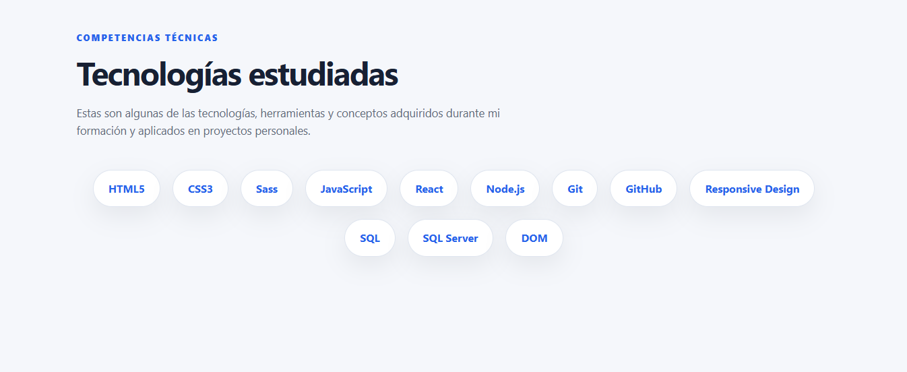
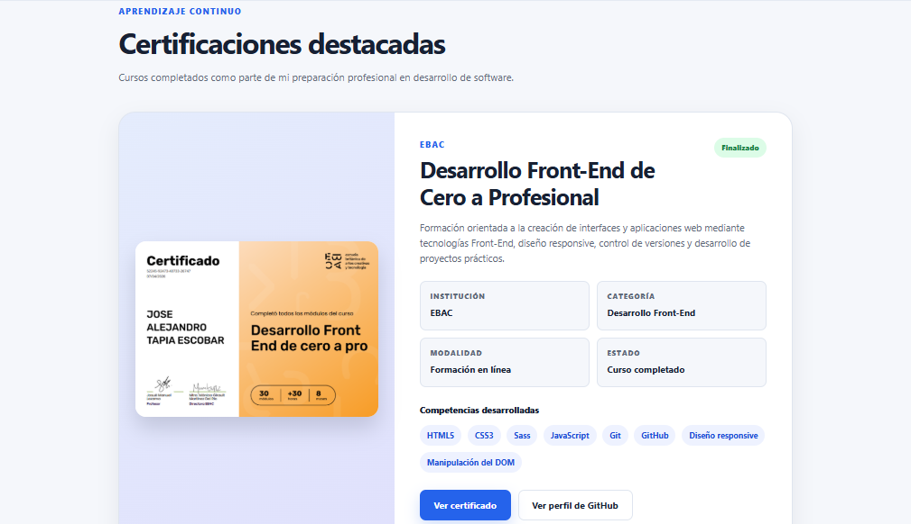
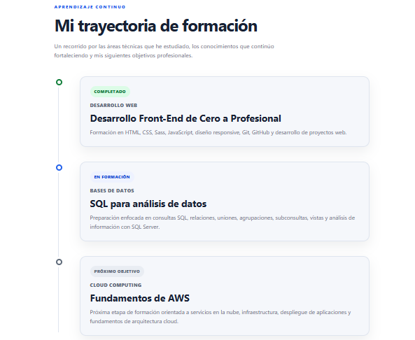

# 📜 Professional Certifications Portfolio

A modern and responsive website designed to showcase my professional certifications, technical courses, and continuous learning journey in Software Development and Cloud Computing.

The goal of this project is to provide recruiters and employers with a centralized place where they can easily explore my certifications, technical skills, and professional growth.

---

# 🌐 Live Demo

https://aescobardev.github.io/certificaciones/

---

# 📖 About the Project

This website is an extension of my professional portfolio and serves as a digital repository of the certifications I have earned throughout my learning journey.

Instead of simply storing PDF certificates, the project organizes them into learning paths, making it easier to understand my technical background and career progression.

The portfolio currently includes certifications in:

- ☁️ Cloud Computing
- 💻 Front-End Development
- 🚀 Professional Development

Each certification includes a short description, issuing organization, completion date, and direct access to the original credential.

---

# ✨ Features

- Modern and responsive interface
- Professional landing page
- Certification gallery
- Learning paths by category
- Professional development timeline
- Technical skills overview
- Direct access to PDF certificates
- GitHub Pages deployment
- Clean and accessible UI

---

# 🎓 Learning Paths

## ☁️ Cloud Computing

- Microsoft Azure Fundamentals AZ-900 Exam Prep
- Introduction to Microsoft Azure Cloud Services
- Microsoft Azure Services and Lifecycles
- Microsoft Azure Management Tools and Security Solutions

---

## 💻 Front-End Development

- Introduction to HTML, CSS & JavaScript
- Getting Started with Git and GitHub
- Developing Front-End Apps with React

---

## 🚀 Professional Development

- Cómo potenciar tu talento

Topics covered:

- Personal Growth
- Professional Branding
- Employability
- Career Development
- Future Readiness
- Entrepreneurship

---

# 🛠 Technologies

- HTML5
- CSS3
- JavaScript
- Responsive Design
- Git
- GitHub
- GitHub Pages

---

# 📂 Project Structure

```text
certificaciones/

│

├── assets/
│   ├── img/
│   ├── icons/
│   └── pdf/

├── css/
│   └── style.css

├── js/
│   └── script.js

├── index.html

└── README.md
```

---

# 📸 Preview

## Hero



---

## Technologies



---

## Learning Paths



---

## Certifications



---

# 📈 Learning Journey

This portfolio reflects my continuous education in modern software development.

Current areas of study include:

✅ Front-End Development

✅ Cloud Computing

✅ Version Control

✅ Professional Development

Currently learning:

- React
- Node.js
- SQL
- AWS Cloud
- Software Engineering Best Practices

---

# 🎯 Future Certifications

Planned certifications include:

- AWS Cloud Practitioner
- AWS Developer Associate
- AWS Solutions Architect Associate
- Microsoft Azure Administrator (AZ-104)
- Docker
- Kubernetes
- Oracle Database
- React Advanced
- Node.js Backend Development

---

# 👨‍💻 Author

## Alejandro Escobar

### Portfolio

https://aescobardev.github.io/aescobardev-portfolio/

### GitHub

https://github.com/aescobardev

### LinkedIn

www.linkedin.com/in/alejandroescobardev

---

# ⭐ Support

If you like this project, consider giving it a ⭐ on GitHub.

It motivates me to continue building new projects and documenting my learning journey.